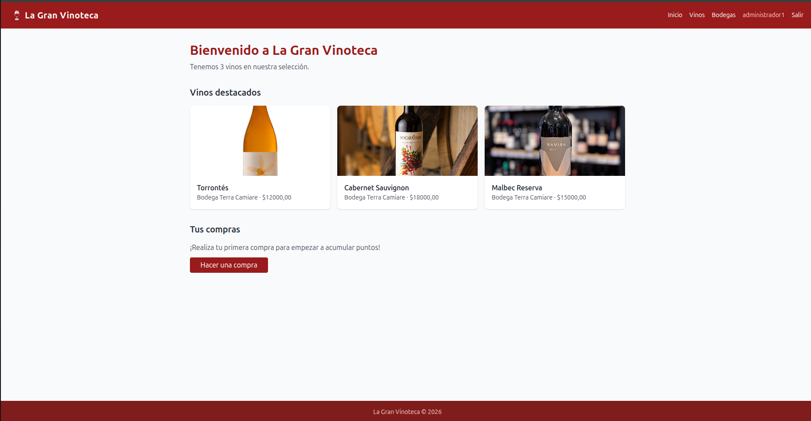
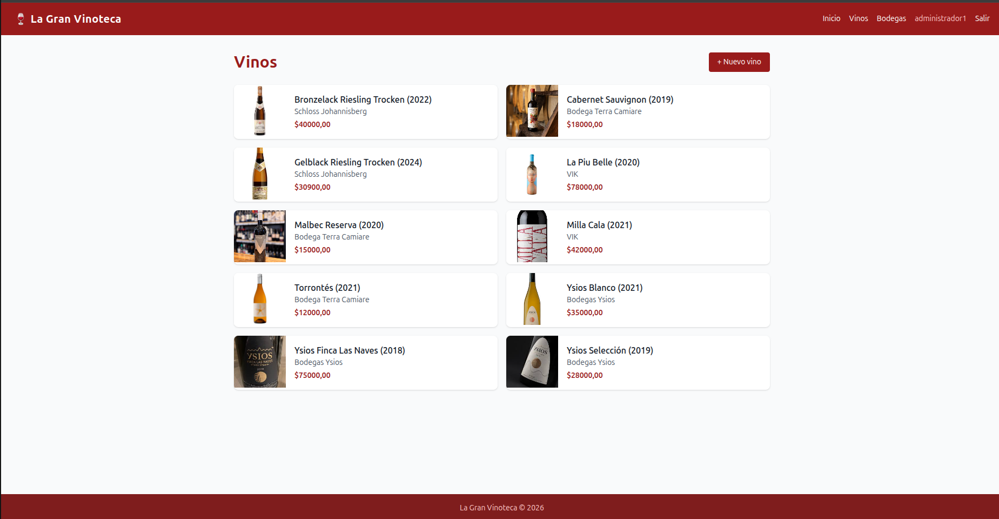
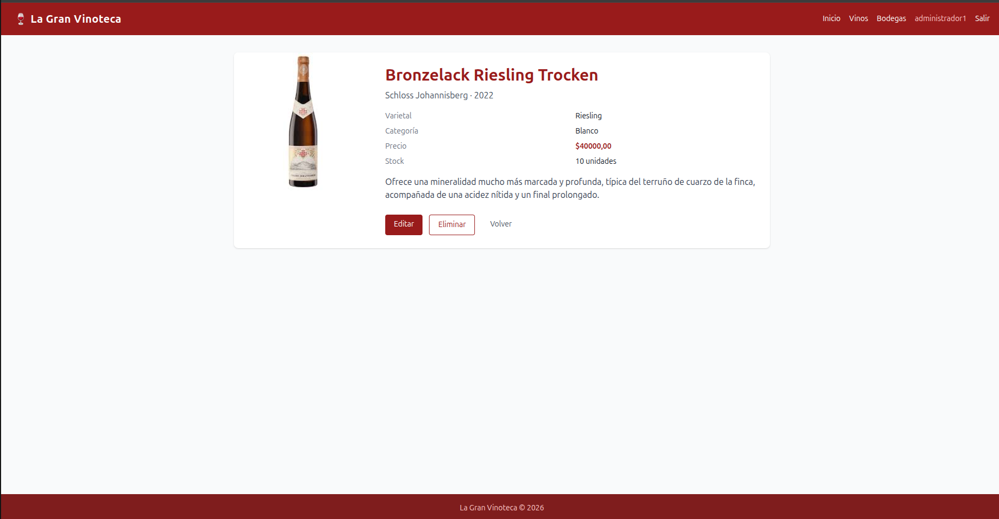
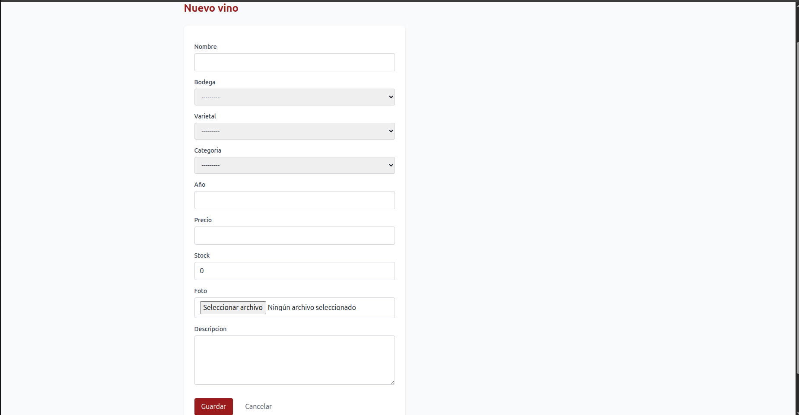
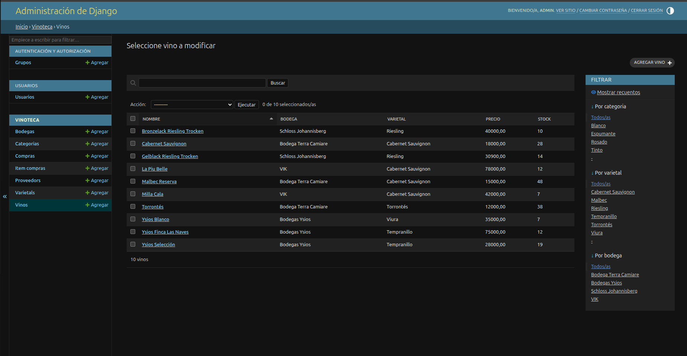
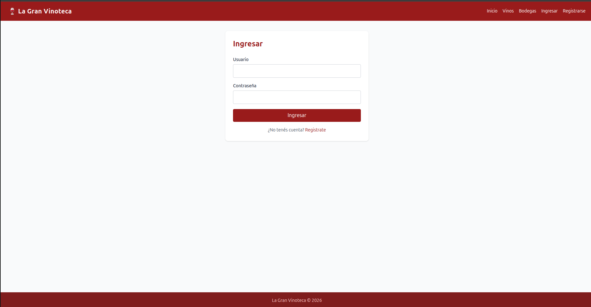
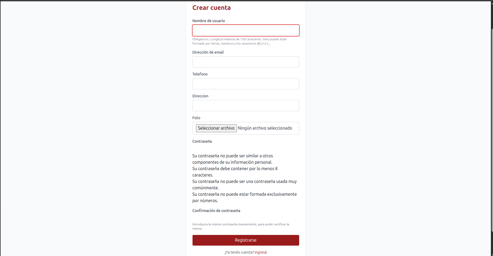
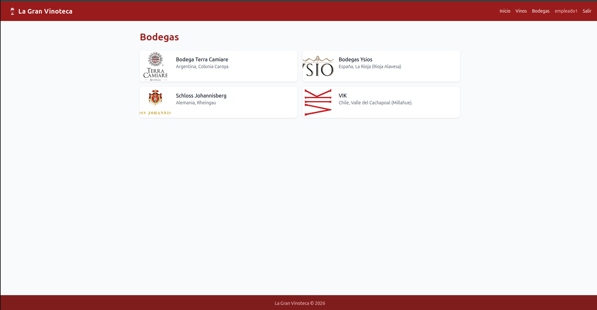
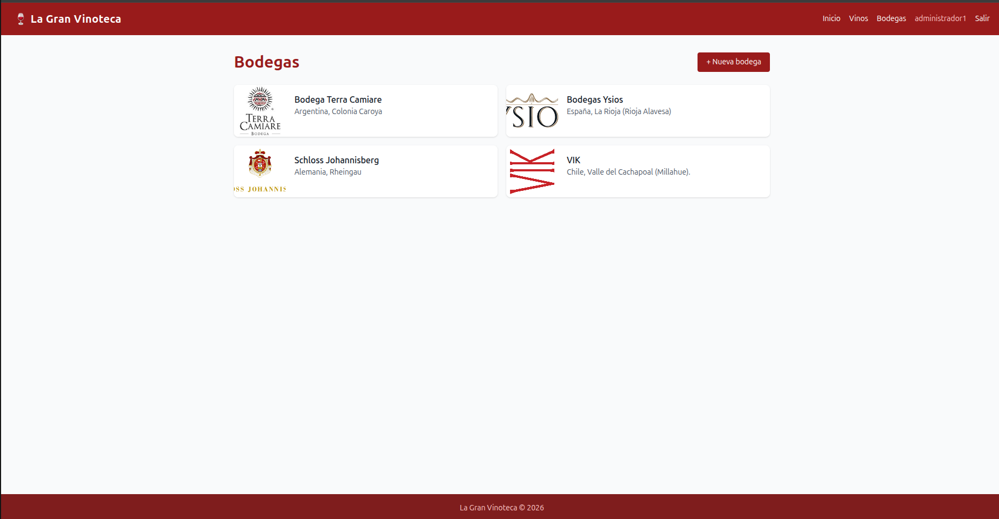
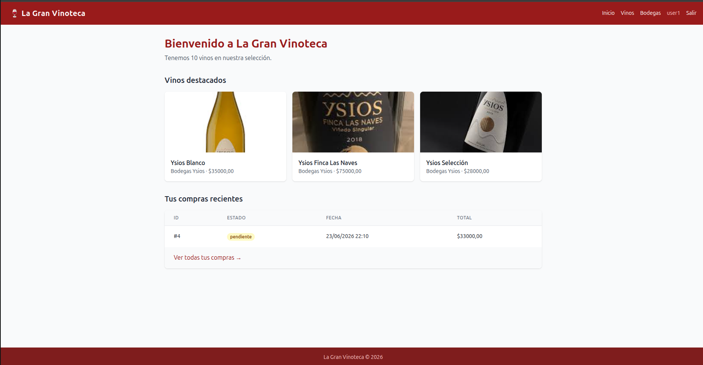

# TP Evaluativo — Sistema de Gestión Vinoteca

## Descripción del sistema

Un sistema completo de gestión para una vinoteca desarrollado con Django y Tailwind CSS. El sistema permite gestionar vinos, bodegas, proveedores, compras y usuarios con un control de acceso basado en permisos y grupos.

## Modelos y relaciones

### 1. Bodega
- **Campos:** nombre, país, región, descripción, logo (ImageField)
- **Relaciones:** Unidireccional a través de `vinos` (ForeignKey desde Vino)

### 2. Varietal
- **Campos:** nombre, descripción
- **Relaciones:** Unidireccional a través de `vinos` (ForeignKey desde Vino)

### 3. Categoria
- **Campos:** nombre (Tinto, Blanco, Rosado, Espumante)
- **Relaciones:** Unidireccional a través de `vinos` (ForeignKey desde Vino)

### 4. Vino
- **Campos:** nombre, año, precio, stock, foto (ImageField), descripción
- **Relaciones:**
  - FK a `Bodega` (relación muchos-a-uno)
  - FK a `Varietal` (relación muchos-a-uno)
  - FK a `Categoria` (relación muchos-a-uno)

### 5. Proveedor
- **Campos:** nombre, email, teléfono
- **Relaciones:** M2M a `Bodega` (relación muchos-a-muchos)

### 6. Compra
- **Campos:** fecha, estado (pendiente/completada/cancelada)
- **Relaciones:**
  - FK a `Usuario` (relación muchos-a-uno)
  - Unidireccional a través de `items` (ForeignKey desde ItemCompra)

### 7. ItemCompra
- **Campos:** cantidad, precio_unitario
- **Relaciones:**
  - FK a `Compra` (relación muchos-a-uno)
  - FK a `Vino` (relación muchos-a-uno)

### 8. Usuario (Personalizado)
- **Campos:** hereda de `AbstractUser` + campos extra: foto (ImageField), teléfono, dirección

## Grupos y permisos

### Grupo Administradores
Otorga todos los permisos sobre: Vino, Bodega, Proveedor, Compra

### Grupo Empleados
Otorga solo permisos `view` y `add` sobre: Vino y Compra

## Funcionalidades principales

### Autenticación
- Registro de nuevos usuarios desde templates
- Login y logout con manejo POST en navbar
- Auto-login después del registro

### CRUDs
- **Vinos:** Lista, detalle, crear, editar, eliminar (5 vistas)
- **Bodegas:** Lista, detalle, crear, editar, eliminar (5 vistas)

### Panel de administración
- Configuración completa con filtros, ordenamiento y búsqueda para:
  - Vino: filtros por categoria, varietal, bodega; búsqueda por nombre
  - Bodega: búsqueda por nombre y país
  - Compra: filtro por estado

### Control de acceso
- Vistas de `create`, `update`, `delete` protegidas con `@permission_required`
- Vistas de `list`, `detail` protegidas con `@login_required`
- Botones en templates mostrados/ocultados según permisos del usuario

### Context processor
- `datos_vinoteca`: Proporciona nombre de la vinoteca, vinos destacados y total de vinos a todos los templates

### Estilos
- Tailwind CSS via CDN (Play CDN para desarrollo)
- Diseño responsive y moderno

## Capturas del proyecto

### 1. Página principal


### 2. Lista de vinos


### 3. Detalle de vino


### 4. Formulario de creación de vino


### 5. Panel de administración


### 6. Login y registro



### 7. Control de permisos





## Instalación y ejecución

### Requisitos previos
- Python 3.8+
- Django 4.2+

### Pasos de instalación

```bash
# Clonar el repositorio
cd /ruta/a/tu/proyecto
git clone https://github.com/usuario/vinoteca-django.git

# Crear y activar entorno virtual
python -m venv venv
source venv/bin/activate  # Windows: venv\Scripts\activate

# Instalar dependencias
pip install -r requirements.txt

# Configurar variables de entorno
# Copiar .env.example a .env y completar las variables

# Ejecutar migraciones
django-admin migrate

# Crear superusuario
django-admin createsuperuser

# Ejecutar servidor de desarrollo
python manage.py runserver
```

### Variables de entorno

```env
# Django settings
DEBUG=True
SECRET_KEY=tu_clave_secreta_aqui

# Base de datos (SQLite por defecto)
DATABASE_URL=sqlite:///db.sqlite3

# Media files
MEDIA_URL=/media/
MEDIA_ROOT=/ruta/completa/a/tu/proyecto/media/
```

### URLs útiles

- **Sitio web:** http://127.0.0.1:8000/
- **Panel de admin:** http://127.0.0.1:8000/admin/

## Estructura del proyecto

```
vinoteca/
├── apps/
│   ├── vinoteca/          # Aplicación principal
│   │   ├── models.py      # Todos los modelos
│   │   ├── views.py       # Vistas FBV
│   │   ├── forms.py       # ModelForms
│   │   ├── admin.py       # Configuración del admin
│   │   ├── context_processors.py  # Context processor personalizado
│   │   └── templates/    # Templates
│   └── usuarios/          # Aplicación de autenticación
│       ├── models.py      # Modelo de usuario personalizado
│       ├── views.py       # Vistas de registro
│       ├── forms.py       # Formulario de registro personalizado
│       └── templates/    # Templates de auth
├── vinotecaproject/       # Proyecto Django
│   ├── settings.py       # Configuración
│   └── urls.py           # URLs principales
├── requirements.txt      # Dependencias
└── manage.py            # Gestor de Django
```

## Tecnologías utilizadas

- **Backend:** Django 6.0.6
- **Frontend:** Tailwind CSS (CDN)
- **Base de datos:** SQLite (o PostgreSQL/MySQL)
- **Control de versiones:** Git
- **Despliegue:** GitHub Pages/Render/Heroku

## Licencia

Este proyecto fue desarrollado como parte del TP Evaluativo 2026 para la carrera de Ingeniería en Software.

## Créditos

Desarrollado por el equipo del TP Evaluativo 2026.
